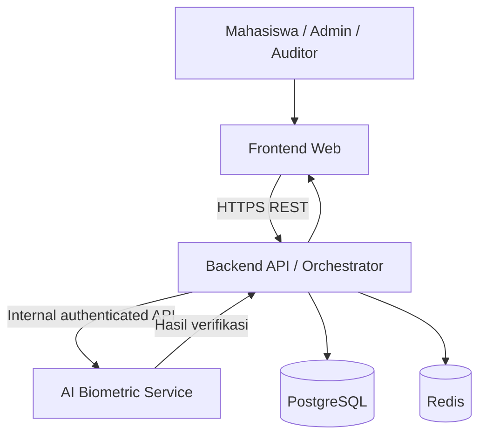

# API Contract
## Smart Campus Voting System with Biometric Facial Verification

| Atribut | Keterangan |
|---|---|
| Proyek | Smart Campus Voting System (E-Voting Kampus) |
| Mata kuliah | Manajemen Pengembangan Perangkat Lunak (MPPL) |
| Dokumen | API Contract — Backend, AI Service, dan Frontend |
| Versi | 1.0 |
| Status | Draft for Team Discussion |
| Backend yang diusulkan | Python / FastAPI |
| AI Service yang diusulkan | Python / FastAPI atau Flask |
| Database | PostgreSQL |
| Cache / token sementara | Redis |
| Gaya API | REST, JSON, OpenAPI |

> **Status dokumen:** Dokumen ini merupakan rancangan awal untuk bahan diskusi tim, disusun berdasarkan PRD proyek. Endpoint, payload, status, serta keputusan teknis yang tidak ditetapkan secara eksplisit dalam PRD diberi status usulan dan perlu disepakati sebelum implementasi.

---

## 1. Tujuan

Dokumen ini mendefinisikan kontrak komunikasi antara Frontend, Backend API, dan AI Service pada Smart Campus Voting System. Kontrak mencakup:

- Autentikasi dan otorisasi pengguna.
- Manajemen Daftar Pemilih Tetap (DPT).
- Registrasi dan verifikasi biometrik.
- Face recognition 1:1 dan liveness detection.
- Penerbitan voting token dan pengiriman suara.
- Rekapitulasi, audit, dan pelaporan.
- Format request/response, error handling, serta persyaratan keamanan integrasi.

Dokumen ini menjadi acuan bersama bagi Backend Engineer, AI Engineer, Frontend Developer, dan QA/Tester. Kontrak final perlu ditinjau dan disetujui oleh anggota tim terkait.

## 2. Ruang Lingkup dan Acuan PRD

Rancangan ini mengacu pada kebutuhan PRD berikut:

1. Admin mengimpor data DPT melalui CSV/Excel.
2. Mahasiswa melakukan registrasi awal dengan 3–5 foto wajah untuk menghasilkan face embedding.
3. Sistem menggunakan verifikasi wajah 1:1 dan liveness detection.
4. Kegagalan pencocokan dibatasi maksimal tiga kali sebelum akun dikunci sementara dan diarahkan ke verifikasi manual.
5. Status pemilih yang sudah menggunakan hak pilih dipisahkan dari pilihan kandidat.
6. Ballot disimpan dalam tabel anonim tanpa foreign key langsung ke NIM pemilih.
7. Sistem menyediakan dashboard, statistik partisipasi, audit trail, dan ekspor laporan.
8. Sistem menggunakan HTTPS/TLS 1.3, password hashing, JWT short-lived, transaksi database atomik, dan pembatasan akses berbasis role.

### 2.1 Di luar cakupan MVP menurut PRD

- Pemungutan suara lintas kampus.
- Integrasi pemindai sidik jari khusus.
- Blockchain private consortium.

## 3. Arsitektur dan Prinsip Integrasi

### 3.1 Komponen

| Komponen | Tanggung jawab |
|---|---|
| Frontend Web/Mobile | UI login, akses kamera, registrasi, bilik suara, dashboard |
| Backend API | Orkestrasi alur, autentikasi, RBAC, validasi hak pilih, integrasi AI, voting, audit |
| AI Service | Ekstraksi embedding, face matching 1:1, liveness detection, hasil biometrik |
| PostgreSQL | Data DPT, status voting, kandidat, ballot anonim, audit |
| Redis | Cache sesi, rate limiting, dan token sementara sesuai desain |
| Docker Compose | Menstandarkan lingkungan pengembangan dan integrasi |

### 3.2 Prinsip arsitektur

1. Backend adalah **orchestrator** dan pemilik alur bisnis.
2. Frontend berkomunikasi dengan Backend API; AI Service tidak dipanggil langsung oleh browser.
3. Backend menjadi satu-satunya komponen aplikasi yang mengakses PostgreSQL.
4. AI Service hanya melakukan pemrosesan biometrik dan mengembalikan hasil terstruktur.
5. AI Service tidak menerbitkan voting token, tidak mengubah `has_voted`, dan tidak memutuskan kelayakan pemilih.
6. Backend memeriksa kembali identitas, status DPT, status voting, sesi, dan hasil biometrik sebelum mengizinkan voting.
7. Identitas pemilih dan pilihan kandidat harus dipisahkan. Penghapusan foreign key langsung saja **belum cukup** untuk membuktikan anonimitas; korelasi melalui token, log, timestamp, atau akses administrator juga harus dipertimbangkan.

### 3.3 Diagram konteks



## 4. Standar API

### 4.1 Konvensi

| Elemen | Standar usulan |
|---|---|
| Backend base path | `/api/v1` |
| AI internal base path | `/internal/v1` |
| Protokol | HTTPS |
| Format data | JSON |
| Upload gambar | `multipart/form-data` |
| Encoding | UTF-8 |
| Timestamp | ISO 8601, UTC |
| API style | REST |
| Dokumentasi | OpenAPI / Swagger |
| Identitas resource | UUID atau ID entitas |
| User authentication | JWT Bearer |
| Service authentication | Kredensial layanan melalui jaringan privat |

### 4.2 Header umum

Request terautentikasi pengguna:

```http
Authorization: Bearer <access_token>
Content-Type: application/json
Accept: application/json
```

Request internal Backend ke AI Service:

```http
Authorization: Bearer <service_token>
X-Request-ID: <request_id>
Content-Type: application/json
```

Untuk upload file, gunakan `multipart/form-data` dan biarkan client HTTP membentuk boundary.

### 4.3 Format response backend

Berhasil:

```json
{
  "success": true,
  "message": "Request berhasil diproses.",
  "data": {},
  "meta": {
    "request_id": "req_7f82a1"
  }
}
```

Gagal:

```json
{
  "success": false,
  "error": {
    "code": "VALIDATION_ERROR",
    "message": "Data yang dikirim tidak valid.",
    "details": []
  },
  "meta": {
    "request_id": "req_7f82a1"
  }
}
```

Field `request_id` digunakan untuk penelusuran teknis. Jangan memasukkan password, JWT, raw image, face embedding, atau voting choice ke log.

### 4.4 Status umum

Status resource yang disarankan:

- `pending`
- `processing`
- `completed`
- `verified`
- `rejected`
- `failed`
- `expired`

Status spesifik harus didefinisikan per endpoint; jangan menganggap semua status berlaku pada setiap resource.

---

## 5. Backend API Specification

Semua endpoint di bagian ini merupakan **usulan kontrak**. Hak akses dan payload final perlu dikonfirmasi tim.

### 5.1 Authentication

#### `POST /api/v1/auth/login`

**Aktor:** Mahasiswa  
**Tujuan:** Memverifikasi NIM dan password serta membuat sesi pengguna.

Request:

```json
{
  "nim": "123456789",
  "password": "<password>"
}
```

Response `200 OK`:

```json
{
  "success": true,
  "data": {
    "access_token": "<jwt>",
    "token_type": "Bearer",
    "expires_in": 900,
    "student": {
      "nim": "123456789",
      "full_name": "Nama Mahasiswa",
      "study_program": "Informatika",
      "is_registered": true,
      "has_voted": false
    }
  }
}
```

Ketentuan:
- Password diverifikasi terhadap hash Argon2id atau BCrypt.
- JWT bersifat short-lived; PRD menetapkan 15 menit.
- Backend memeriksa status DPT dan akun.
- Password dan password hash tidak boleh dikembalikan.
- Respons tidak boleh mengungkapkan data mahasiswa yang tidak diperlukan.

#### `POST /api/v1/auth/refresh` — opsional

**Aktor:** Pengguna terautentikasi melalui refresh token  
**Tujuan:** Memperbarui access token jika tim memutuskan menggunakan refresh token.

Request:

```json
{
  "refresh_token": "<refresh_token>"
}
```

Response `200 OK`:

```json
{
  "success": true,
  "data": {
    "access_token": "<new_jwt>",
    "token_type": "Bearer",
    "expires_in": 900
  }
}
```

Refresh token bukan persyaratan eksplisit PRD dan dapat dikeluarkan dari MVP.

### 5.2 DPT management

#### `POST /api/v1/admin/voters/import`

**Aktor:** `ADMIN`  
**Tujuan:** Mengimpor data DPT dari CSV/Excel.

Request: `multipart/form-data`

```text
file: dpt_mahasiswa.csv
```

Response `200 OK`:

```json
{
  "success": true,
  "data": {
    "total_rows": 500,
    "imported": 490,
    "skipped": 10,
    "errors": [
      {
        "row": 12,
        "code": "DUPLICATE_NIM",
        "message": "NIM sudah terdaftar."
      }
    ]
  }
}
```

Validasi minimal:
- Format dan ukuran file.
- Kolom wajib: NIM, nama, program studi, email kampus.
- Duplikasi NIM dan email sesuai kebijakan.
- Hak akses admin dan pencatatan audit.

### 5.3 Biometric registration

#### `POST /api/v1/biometric/register`

**Aktor:** `STUDENT`  
**Tujuan:** Memulai registrasi wajah mahasiswa yang terdaftar di DPT.

Request: `multipart/form-data`

```text
images: [face_1.jpg, face_2.jpg, face_3.jpg]
```

Response `202 Accepted`:

```json
{
  "success": true,
  "data": {
    "registration_id": "reg_123abc",
    "status": "processing",
    "message": "Registrasi wajah sedang diproses."
  }
}
```

Ketentuan:
- PRD menyebutkan 3–5 foto wajah.
- Backend memastikan mahasiswa berhak melakukan registrasi.
- Backend memanggil AI Service untuk ekstraksi embedding.
- Backend menyimpan embedding dan metadata model setelah hasil tervalidasi.
- Foto mentah diproses sementara dan dihapus sesuai kebijakan retensi yang disepakati.

#### `GET /api/v1/biometric/register/{registration_id}`

**Aktor:** `STUDENT` pemilik registrasi  
**Tujuan:** Memeriksa status registrasi.

Response `200 OK`:

```json
{
  "success": true,
  "data": {
    "registration_id": "reg_123abc",
    "status": "completed",
    "is_registered": true
  }
}
```

Status usulan: `pending`, `processing`, `completed`, `failed`.

### 5.4 Biometric verification

#### `POST /api/v1/biometric/verify`

**Aktor:** `STUDENT`  
**Tujuan:** Memulai verifikasi wajah dan liveness.

Request: `multipart/form-data`

```text
frames: [frame_1.jpg, frame_2.jpg, ...]
challenge_id: ch_8f12ab
```

Backend memperoleh identitas mahasiswa dari JWT, bukan dari NIM bebas dalam request. Challenge harus dibuat atau divalidasi backend, memiliki nonce acak dan masa berlaku.

Response `202 Accepted`:

```json
{
  "success": true,
  "data": {
    "verification_id": "ver_8f12ab",
    "status": "processing",
    "expires_in": 120
  }
}
```

#### `GET /api/v1/biometric/status/{verification_id}`

**Aktor:** `STUDENT` pemilik sesi  
**Tujuan:** Mengambil status verifikasi.

Response `200 OK`:

```json
{
  "success": true,
  "data": {
    "verification_id": "ver_8f12ab",
    "status": "verified",
    "verified_at": "2026-10-02T07:30:00Z",
    "attempts_remaining": 2
  }
}
```

Status usulan: `pending`, `processing`, `verified`, `rejected`, `expired`, `failed`.

Ketentuan:
- Backend memeriksa status DPT, status voting, dan sesi aktif.
- Backend mengambil embedding terdaftar dan mengirim data minimum yang diperlukan ke AI.
- Backend memvalidasi hasil AI sebelum mengubah status sesi.
- Kegagalan pencocokan dihitung sesuai kebijakan maksimum tiga kali dalam PRD.
- Kegagalan infrastruktur, seperti AI timeout, tidak otomatis dihitung sebagai kegagalan biometrik pemilih.
- Detail embedding dan similarity score tidak perlu ditampilkan kepada frontend.

### 5.5 Candidate management

#### `GET /api/v1/candidates`

**Aktor:** `STUDENT`, `ADMIN`  
**Tujuan:** Mengambil kandidat pada pemilihan tertentu.

Query:

```text
election_type=HIMA
```

Response `200 OK`:

```json
{
  "success": true,
  "data": [
    {
      "candidate_id": 1,
      "election_type": "HIMA",
      "leader_name": "Kandidat A",
      "co_leader_name": "Kandidat B",
      "vision_mission": "Visi dan misi kandidat",
      "photo_url": "https://example.com/photo.jpg"
    }
  ]
}
```

#### `POST /api/v1/admin/candidates`

**Aktor:** `ADMIN`  
**Tujuan:** Menambahkan kandidat.

Request:

```json
{
  "election_type": "HIMA",
  "leader_name": "Kandidat A",
  "co_leader_name": "Kandidat B",
  "vision_mission": "Visi dan misi kandidat",
  "photo_url": "https://example.com/photo.jpg"
}
```

Response `201 Created`:

```json
{
  "success": true,
  "data": {
    "candidate_id": 1,
    "status": "created"
  }
}
```

Operasi pembaruan dan penghapusan kandidat dapat ditambahkan sesuai kebijakan penguncian data setelah pemilihan dimulai.

### 5.6 Voting token

#### `POST /api/v1/voting/token`

**Aktor:** `STUDENT` dengan verifikasi valid  
**Tujuan:** Menerbitkan token pemungutan suara sekali pakai.

Request:

```json
{
  "verification_id": "ver_8f12ab"
}
```

Response `201 Created`:

```json
{
  "success": true,
  "data": {
    "voting_token": "<opaque_one_time_token>",
    "token_type": "Bearer",
    "expires_in": 300,
    "election_id": "el_2026_hima"
  }
}
```

Ketentuan:
- Verifikasi harus berhasil dan belum kedaluwarsa.
- Mahasiswa harus masih memenuhi syarat memilih.
- Status pemilih harus belum menggunakan hak suara.
- Token harus acak, berumur pendek, terikat pada pemilihan, dan hanya dapat digunakan sekali.
- Desain token harus mempertimbangkan unlinkability antara identitas pemilih dan ballot.

### 5.7 Cast vote

#### `POST /api/v1/voting/cast`

**Aktor:** Pemegang voting token valid  
**Tujuan:** Menerima pilihan kandidat dan mencatat ballot anonim.

Request:

```http
Authorization: Bearer <voting_token>
Idempotency-Key: idem_72ab91
Content-Type: application/json
```

```json
{
  "candidate_id": 1,
  "election_id": "el_2026_hima",
  "idempotency_key": "idem_72ab91"
}
```

Response `201 Created`:

```json
{
  "success": true,
  "data": {
    "receipt_id": "rcpt_8f12ab",
    "receipt_hash": "<sha256_hash>",
    "status": "accepted",
    "message": "Suara berhasil diterima."
  }
}
```

Ketentuan:
- Token divalidasi dan dikonsumsi secara atomik.
- Kandidat harus valid dan terdaftar pada pemilihan yang sesuai.
- Idempotency key mencegah pemrosesan ulang akibat retry.
- Ballot disimpan tanpa NIM atau foreign key langsung ke identitas pemilih.
- Kegagalan transaksi harus menghasilkan rollback.
- Respons receipt tidak boleh mengungkapkan kandidat yang dipilih.
- Desain transaksi dan token harus menghindari korelasi identitas dengan pilihan.

### 5.8 Vote receipt

#### `GET /api/v1/voting/receipt/{receipt_id}`

**Aktor:** Pemegang receipt atau akses verifikasi publik terbatas  
**Tujuan:** Memeriksa status penerimaan suara tanpa menampilkan pilihan kandidat.

Response `200 OK`:

```json
{
  "success": true,
  "data": {
    "receipt_id": "rcpt_8f12ab",
    "receipt_hash": "<sha256_hash>",
    "status": "accepted",
    "election_id": "el_2026_hima"
  }
}
```

Mekanisme pembuktian receipt, autentikasi pemegang receipt, dan verifikasi integritas hasil akhir perlu ditentukan lebih lanjut. Hash SHA-256 saja tidak membuktikan bahwa ballot telah dihitung dengan benar.

### 5.9 Admin, analytics, dan audit

| Method | Endpoint | Role | Fungsi |
|---|---|---|---|
| `GET` | `/api/v1/admin/dashboard` | `ADMIN` | Ringkasan pemilihan |
| `GET` | `/api/v1/admin/analytics/turnout` | `ADMIN`, `AUDITOR` | Statistik partisipasi |
| `GET` | `/api/v1/admin/analytics/results` | `ADMIN`, `AUDITOR` | Rekap hasil sesuai kebijakan publikasi |
| `GET` | `/api/v1/admin/audit-logs` | `ADMIN`, `AUDITOR` | Riwayat aktivitas |
| `POST` | `/api/v1/admin/elections` | `ADMIN` | Membuat pemilihan |
| `PATCH` | `/api/v1/admin/elections/{election_id}` | `ADMIN` | Mengubah jadwal/status |
| `GET` | `/api/v1/admin/reports/export` | `ADMIN`, `AUDITOR` | Ekspor PDF/CSV |

Akses dashboard hasil harus mengikuti kebijakan KPUM, termasuk apakah live count ditampilkan selama pemilihan atau baru setelah TPS ditutup.

---

## 6. AI Service API Specification

AI Service merupakan layanan internal yang hanya dipanggil Backend API. Endpoint di bawah adalah rancangan yang perlu disepakati dengan AI Engineer.

### 6.1 Register face embedding

#### `POST /internal/v1/face/register`

**Tujuan:** Memproses 3–5 foto wajah dan menghasilkan embedding.

Request: `multipart/form-data`

```text
registration_id: reg_123abc
images: [image_1.jpg, image_2.jpg, image_3.jpg]
model_version: face-model-v1
```

Response `200 OK`:

```json
{
  "success": true,
  "data": {
    "registration_id": "reg_123abc",
    "status": "completed",
    "embedding": {
      "model": "InsightFace",
      "version": "face-model-v1",
      "dimension": 512,
      "vector": [0.123, -0.456, 0.789]
    },
    "quality": {
      "accepted_images": 3,
      "rejected_images": 0
    }
  }
}
```

Vektor dalam contoh hanya ilustrasi, bukan representasi embedding lengkap.

Tanggung jawab AI:
- Deteksi wajah dan pemeriksaan kualitas gambar.
- Ekstraksi embedding menggunakan model dan preprocessing yang konsisten.
- Melaporkan jumlah foto yang diterima/ditolak.
- Mengembalikan dimensi dan versi model.
- Mengembalikan error yang jelas bila registrasi tidak dapat diproses.

Tanggung jawab Backend:
- Validasi mahasiswa dan izin registrasi.
- Memanggil AI Service dengan data minimum.
- Memvalidasi struktur hasil dan menyimpan embedding serta metadata.
- Mengatur retensi/penghapusan foto sementara.

### 6.2 Face verification dan liveness

#### `POST /internal/v1/face/verify`

**Tujuan:** Melakukan face matching 1:1 dan liveness detection.

Request konseptual:

```json
{
  "verification_id": "ver_8f12ab",
  "reference_embedding": [0.123, -0.456, 0.789],
  "model_version": "face-model-v1",
  "challenge": {
    "challenge_id": "ch_8f12ab",
    "type": "blink",
    "nonce": "random_nonce",
    "issued_at": "2026-10-02T07:30:00Z"
  },
  "frames": [
    "<frame_1>",
    "<frame_2>",
    "<frame_3>"
  ]
}
```

Dalam implementasi, frame sebaiknya dikirim melalui multipart atau mekanisme transfer internal yang disepakati, bukan sebagai placeholder JSON.

Response berhasil:

```json
{
  "success": true,
  "data": {
    "verification_id": "ver_8f12ab",
    "status": "completed",
    "face_match": {
      "verified": true,
      "similarity": 0.91,
      "threshold_version": "threshold-v1"
    },
    "liveness": {
      "verified": true,
      "method": "blink",
      "challenge_passed": true
    },
    "model_version": "face-model-v1",
    "processed_at": "2026-10-02T07:30:00Z"
  }
}
```

Response penolakan:

```json
{
  "success": true,
  "data": {
    "verification_id": "ver_8f12ab",
    "status": "completed",
    "face_match": {
      "verified": false,
      "similarity": 0.62,
      "threshold_version": "threshold-v1"
    },
    "liveness": {
      "verified": true,
      "method": "blink",
      "challenge_passed": true
    },
    "model_version": "face-model-v1",
    "processed_at": "2026-10-02T07:30:00Z"
  }
}
```

Catatan:
- Angka similarity di atas hanya contoh.
- Threshold harus diuji dan dikalibrasi berdasarkan model serta data evaluasi.
- Hasil AI merupakan input keputusan backend, bukan otorisasi voting final.
- Backend harus memastikan `verification_id`, challenge, dan sesi masih valid.
- AI Service tidak boleh mengubah status pemilih atau menerbitkan voting token.

### 6.3 Liveness endpoint terpisah — opsional

#### `POST /internal/v1/liveness/check`

Endpoint ini hanya diperlukan jika AI Engineer memutuskan memisahkan liveness dari face verification.

Request:

```json
{
  "verification_id": "ver_8f12ab",
  "challenge": {
    "challenge_id": "ch_8f12ab",
    "type": "blink",
    "nonce": "random_nonce"
  },
  "frames": [
    "<frame_1>",
    "<frame_2>",
    "<frame_3>"
  ]
}
```

Response:

```json
{
  "success": true,
  "data": {
    "verification_id": "ver_8f12ab",
    "liveness_verified": true,
    "challenge_passed": true,
    "method": "blink"
  }
}
```

Untuk MVP, satu endpoint gabungan `/face/verify` lebih sederhana jika sesuai dengan pipeline AI.

### 6.4 Health check

#### `GET /internal/v1/health`

Response `200 OK`:

```json
{
  "status": "healthy",
  "service": "biometric-ai",
  "model_loaded": true,
  "model_version": "face-model-v1"
}
```

Endpoint ini digunakan untuk memeriksa kesiapan layanan. Jangan memasukkan detail infrastruktur sensitif dalam respons yang dapat diakses publik.

---

## 7. Error Handling

### 7.1 Format error

```json
{
  "success": false,
  "error": {
    "code": "FACE_MISMATCH",
    "message": "Wajah tidak cocok dengan data terdaftar.",
    "retryable": true
  },
  "verification_id": "ver_8f12ab"
}
```

### 7.2 Kode error yang disepakati

| HTTP | Error code | Makna |
|---|---|---|
| 400 | `INVALID_REQUEST` | Request tidak valid |
| 400 | `INVALID_IMAGE` | Format gambar tidak valid |
| 400 | `NO_FACE_DETECTED` | Tidak ada wajah terdeteksi |
| 401 | `UNAUTHORIZED` | Autentikasi gagal |
| 401 | `SERVICE_UNAUTHORIZED` | Autentikasi layanan internal gagal |
| 403 | `FORBIDDEN` | Pengguna tidak memiliki izin |
| 404 | `RESOURCE_NOT_FOUND` | Resource tidak ditemukan |
| 409 | `ALREADY_VOTED` | Hak suara sudah digunakan |
| 409 | `TOKEN_ALREADY_USED` | Token telah digunakan |
| 413 | `IMAGE_TOO_LARGE` | Ukuran gambar melebihi batas |
| 422 | `FACE_MISMATCH` | Wajah tidak cocok |
| 422 | `LIVENESS_FAILED` | Liveness tidak lolos |
| 429 | `TOO_MANY_ATTEMPTS` | Batas percobaan terlampaui |
| 429 | `RATE_LIMITED` | Rate limit terlampaui |
| 500 | `INTERNAL_ERROR` | Kesalahan internal |
| 502 | `AI_INVALID_RESPONSE` | Respons AI tidak valid |
| 503 | `AI_SERVICE_UNAVAILABLE` | AI Service tidak tersedia |
| 504 | `AI_TIMEOUT` | AI Service melewati batas waktu |

### 7.3 Kebijakan retry

- Kesalahan validasi input tidak di-retry tanpa perubahan request.
- Kegagalan biometrik dapat diulang sesuai batas percobaan PRD.
- Timeout atau gangguan AI tidak otomatis mengurangi percobaan biometrik.
- Request voting harus menggunakan idempotency key.
- Backend tidak boleh menerbitkan token voting ketika hasil biometrik tidak dapat divalidasi.
- Retry pada operasi yang mengubah status harus aman terhadap duplikasi.

---

## 8. Security Requirements

| Area | Persyaratan |
|---|---|
| Transport | HTTPS/TLS 1.3 untuk data transit eksternal |
| Password | Argon2id atau BCrypt |
| Session | JWT short-lived, 15 menit |
| Authorization | RBAC |
| Internal API | Service authentication dan jaringan privat |
| Biometrics | Enkripsi embedding saat tersimpan dan saat dikirim |
| Liveness | Challenge acak, nonce, expiry, dan proteksi replay |
| Rate limiting | Pembatasan login dan percobaan verifikasi |
| Voting | Token sekali pakai dan transaksi atomik |
| Ballot secrecy | Pemisahan identitas dan pilihan kandidat |
| Audit | Catat peristiwa penting tanpa rahasia autentikasi atau biometrik |
| Privacy | Minimasi data, pembatasan akses, retensi, dan penghapusan sesuai kebijakan |

### 8.1 Catatan khusus secret ballot

Pemisahan tabel `VOTING_STATUS` dan `BALLOT_BOX` merupakan dasar rancangan PRD, tetapi belum cukup untuk menjamin unlinkability.

Tim perlu meninjau:
- Apakah voting token dapat dikaitkan dengan NIM oleh penerbit token.
- Apakah token atau verification ID tercatat pada ballot.
- Apakah timestamp, IP address, request log, atau metadata dapat menghubungkan pemilih dengan pilihan.
- Siapa yang memiliki akses ke data status voting dan ballot.
- Bagaimana receipt membuktikan partisipasi tanpa membocorkan pilihan.
- Bagaimana integritas hasil akhir diverifikasi.

Jika klaim anonimitas yang kuat menjadi persyaratan, pertimbangkan mekanisme token anonim atau blind signature yang dirancang dan ditinjau secara khusus. Jangan mengklaim bahwa tidak ada pihak yang dapat mengetahui pilihan pemilih sebelum mekanismenya benar-benar diimplementasikan dan diuji.

---

## 9. Database Mapping

Pemetaan awal berdasarkan ERD PRD:

| Entitas | Atribut utama | API terkait |
|---|---|---|
| `STUDENT_DPT` | `nim`, `full_name`, `study_program`, `email`, `password_hash`, `face_embedding`, `is_registered` | Auth, DPT, biometric registration |
| `VOTING_STATUS` | `nim`, `has_voted`, `voted_at`, `verification_method` | Eligibility, voting |
| `CANDIDATES` | `candidate_id`, `election_type`, `leader_name`, `co_leader_name`, `vision_mission`, `photo_url` | Candidate management, ballot |
| `BALLOT_BOX` | `ballot_id`, `candidate_id`, `election_type`, `casted_at`, `vote_hash` | Cast vote, results, receipt |
| `AUDIT_LOGS` | `log_id`, `event_type`, `ip_address`, `timestamp`, `description` | Audit, monitoring |

### 9.1 Usulan tambahan untuk implementasi

Tambahan berikut belum menjadi bagian eksplisit ERD PRD dan perlu persetujuan tim:

- `elections`: identitas, jadwal, dan status pemilihan.
- `biometric_verifications`: sesi dan status verifikasi.
- `voting_tokens`: metadata token dan status konsumsi, atau penyimpanan sementara di Redis.
- `idempotency_records`: deduplikasi operasi voting.
- Metadata embedding: versi model, dimensi, dan waktu registrasi.

Hindari menyimpan informasi yang menghubungkan identitas pemilih dengan pilihan kandidat dalam satu rekaman atau melalui kunci korelasi yang dapat diakses administrator.

---

## 10. Non-Functional Requirements dan Acceptance Criteria

Target dari PRD:

| Metrik | Target | Pengujian |
|---|---|---|
| Face inference | < 1,5 detik per verifikasi | Benchmark AI |
| Voting flow | < 90 detik per mahasiswa | End-to-end test |
| Peak concurrency | 100 suara per menit | Load test |
| Availability | 99,5% selama jam voting | Uptime monitoring |
| FAR | < 0,1% | Impostor evaluation |
| FRR | < 2,0% | Genuine-user evaluation |
| Duplicate voting | Tidak terjadi | Concurrent transaction test |
| Spoof resistance | Menolak serangan foto/video sesuai cakupan pengujian | Spoof test |

Target tersebut merupakan sasaran penerimaan, bukan hasil yang sudah terbukti. Tim QA perlu menetapkan dataset evaluasi, perangkat pengujian, prosedur pengukuran, serta pelaporan hasil.

---

## 11. Integration Testing

| Skenario | Hasil yang diharapkan |
|---|---|
| Mahasiswa valid login | Sesi berhasil dibuat |
| NIM tidak terdaftar | Login ditolak |
| Registrasi 3–5 foto valid | Embedding dibuat dan disimpan |
| Gambar tidak valid | Error validasi yang sesuai |
| Wajah cocok dan liveness lolos | Verifikasi berhasil |
| Wajah tidak cocok | Verifikasi ditolak |
| Foto statis ditampilkan ke kamera | Liveness menolak sesuai kemampuan model |
| AI Service timeout | Tidak ada voting token diterbitkan |
| Challenge kedaluwarsa | Sesi ditolak |
| Challenge/nonce dipakai ulang | Request ditolak |
| Percobaan biometrik melewati batas | Akun dikunci sementara dan diarahkan ke verifikasi manual |
| Voting token digunakan dua kali | Penggunaan kedua ditolak |
| Dua request voting bersamaan | Maksimal satu suara diterima |
| Kandidat tidak valid | Voting ditolak |
| Koneksi terputus saat submit | Retry tidak menghasilkan suara ganda |
| Receipt diverifikasi | Status penerimaan dapat dikonfirmasi tanpa mengungkap kandidat |

---

## 12. Pembagian Tugas Integrasi

| Peran | Tanggung jawab |
|---|---|
| Backend & Security Engineer | API utama, auth, RBAC, database, orkestrasi AI, voting, token, audit, keamanan |
| AI / Computer Vision Engineer | Face embedding, matching 1:1, liveness, evaluasi model, AI Service API |
| Frontend Developer | UI, kamera, integrasi endpoint, bilik suara, dashboard |
| QA / Tester | Black-box, integrasi, spoof testing, concurrency, security testing |
| Project Manager / System Analyst | Validasi kebutuhan, persetujuan kontrak, dokumentasi dan koordinasi |

---

## 13. Rencana Implementasi

### Tahap 1 — Contract Review
- Tinjau endpoint dan payload bersama AI Engineer dan Frontend Developer.
- Tetapkan format embedding, threshold, liveness, error code, dan autentikasi internal.
- Setujui rancangan anonimitas voting.

### Tahap 2 — Backend Foundation
- Inisialisasi FastAPI, PostgreSQL, Redis, dan Docker Compose.
- Buat schema dan migration.
- Implementasikan login, RBAC, DPT, dan kandidat.

### Tahap 3 — Mock AI Service
- Buat mock endpoint untuk hasil sukses, gagal, dan timeout.
- Implementasikan verification session, challenge, dan percobaan ulang.
- Uji alur tanpa menunggu model AI selesai.

### Tahap 4 — AI Integration
- Integrasikan endpoint AI sebenarnya.
- Uji registrasi embedding, matching, liveness, serta error handling.
- Lakukan benchmark dan evaluasi akurasi.

### Tahap 5 — Voting and Security
- Implementasikan voting token dan anonymous ballot.
- Uji transaksi atomik, idempotency, replay, dan korelasi identitas–suara.
- Integrasikan audit log dan analytics.

### Tahap 6 — QA and Release
- Jalankan end-to-end, load, dan security testing.
- Siapkan deployment Docker.
- Dokumentasikan API dan prosedur demo.

---

## 14. Keputusan Terbuka untuk Diskusi Tim

| Topik | Usulan awal | Status |
|---|---|---|
| Backend framework | FastAPI | Perlu disepakati |
| AI framework | FastAPI atau Flask | Perlu disepakati |
| Face recognition model | InsightFace atau alternatif | Perlu evaluasi AI |
| Embedding dimension | 128-d atau 512-d sesuai model | Menunggu pilihan model |
| Similarity threshold | Evaluasi nilai awal 0,85 dari PRD | Perlu validasi |
| Liveness method | Blink atau gerakan acak | Perlu disepakati |
| Image transport | Multipart/form-data | Usulan |
| AI processing | Sinkron bila memenuhi SLA; asinkron bila perlu | Perlu uji |
| Voting token | Opaque, one-time, short-lived | Usulan |
| Token unlinkability | Blind signature atau desain anonim yang ditinjau | Wajib dibahas |
| Redis usage | Session, rate limiting, temporary token | Usulan |
| OpenAPI ownership | Backend mengelola kontrak utama, AI menyediakan skema internal | Usulan |
| Data retention | Minimasi dan penghapusan foto sementara | Perlu kebijakan |

---

## 15. Definition of Done API Contract

API Contract dapat dinyatakan siap untuk implementasi setelah:

- [ ] Backend, AI, dan frontend menyetujui endpoint yang menjadi tanggung jawab masing-masing.
- [ ] Request dan response untuk endpoint utama telah disepakati.
- [ ] Format embedding, versi model, dan preprocessing telah ditentukan.
- [ ] Threshold dan prosedur evaluasi biometrik telah ditentukan.
- [ ] Metode liveness dan challenge telah disepakati.
- [ ] Error code, timeout, retry, dan rate limiting telah didefinisikan.
- [ ] Autentikasi dan otorisasi antarlayanan telah dirancang.
- [ ] Database mapping dan status pemilihan telah disetujui.
- [ ] Mekanisme token, transaksi voting, receipt, dan secret ballot telah ditinjau.
- [ ] Spesifikasi OpenAPI tersedia dan dapat digunakan oleh tim frontend serta QA.
- [ ] Acceptance criteria dan skenario integrasi telah disepakati.

---

**Acuan utama:** Product Requirements Document (PRD), *Smart Voting System Using Face Recognition (E-Voting Kampus)*, Version 1.0 — Draft for Review & Milestone Update.

**Status akhir dokumen:** Draft untuk diskusi dan review tim. Rancangan ini menerjemahkan kebutuhan PRD menjadi usulan kontrak API; detail yang belum diputuskan tidak dianggap sebagai persyaratan final.
