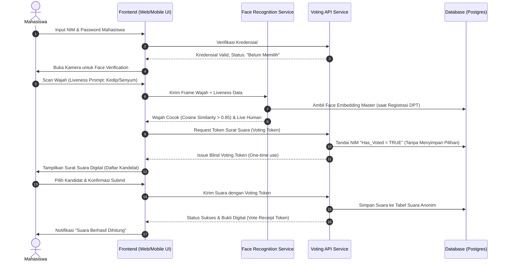
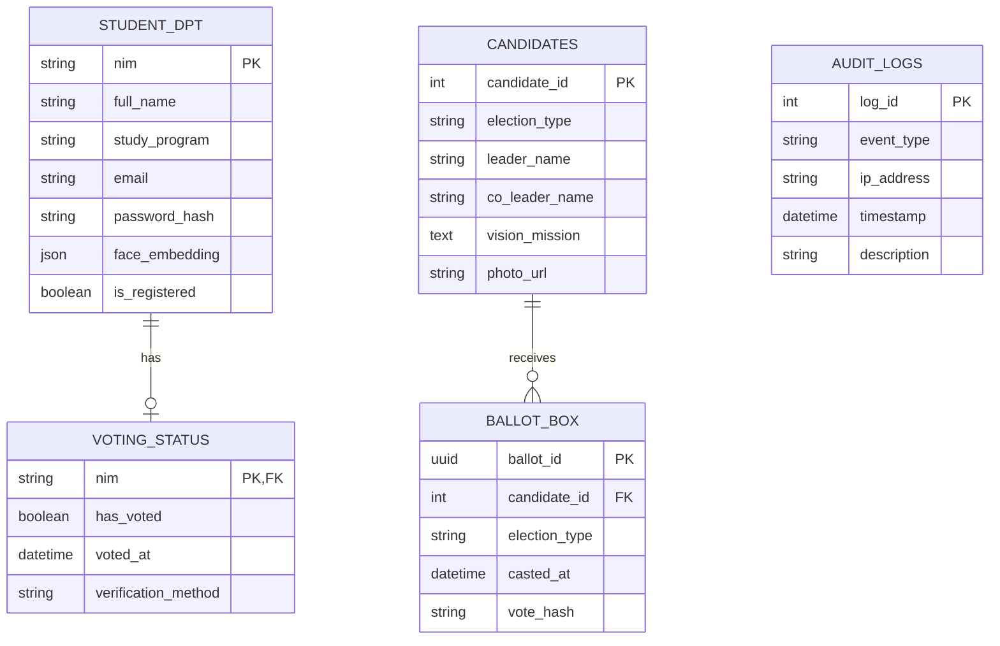
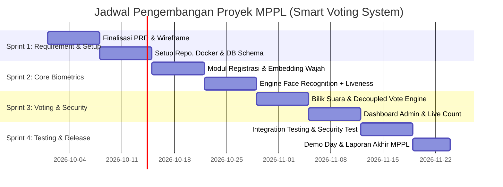

# Product Requirements Document (PRD)
## Smart Voting System Using Face Recognition (E-Voting Kampus)

| Atribut Dokumen | Keterangan |
| :--- | :--- |
| **Nama Proyek** | Smart Campus Voting System with Biometric Facial Verification |
| **Mata Kuliah** | Manajemen Pengembangan Perangkat Lunak (MPPL) |
| **Peran** | Lead / Senior Software Engineer |
| **Status Dokumen** | Version 1.0 (Draft for Review & Milestone Update) |
| **Target Rilis** | MVP (Minimum Viable Product) untuk Pemilihan Ketua Himpunan & DEMA |

---

## 1. Executive Summary & Problem Statement

### 1.1 Latar Belakang
Pemilihan umum mahasiswa (Pemilu Raya / Pemira, Pemilihan Ketua Himpunan, DEMA/BEM) di lingkungan kampus seringkali menghadapi berbagai kendala struktural:
1. **Rendahnya Partisipasi (Golput)**: Sistem bilik suara konvensional berbasis kertas (paper-based) memerlukan kehadiran fisik pemilih di TPS yang terbatas jam operasionalnya.
2. **Kecurangan Identitas & Joki Akun**: Sistem online voting sederhana berbasis *NIM + Password/OTP* sangat rentan terhadap praktik titip suara (akun dipinjamkan ke tim sukses calon).
3. **Rekapitulasi Manual & Rawan Human Error**: Penghitungan suara fisik memakan waktu berjam-jam hingga berhari-hari serta memicu konflik transparansi antar saksi.

### 1.2 Solusi yang Diajukan
Mengembangkan **Smart Voting System berbasis Pengenalan Wajah (Face Recognition)** yang memadukan fleksibilitas e-voting dengan verifikasi biometrik real-time. Sistem memastikan asas pemilu: **Langsung, Umum, Bebas, Rahasia, Jujur, dan Adil (LUBER JURDIL)** melalui:
- **Biometric 1:1 Verification**: Memastikan pemegang hak pilih adalah mahasiswa aktif yang bersangkutan.
- **Anti-Spoofing / Liveness Detection**: Menangkal serangan joki foto/layar HP (*replay attack*).
- **Decoupled Ballot Cryptography**: Memisahkan identitas pemilih dari pilihan kandidat demi menjamin kerahasiaan suara (*secret ballot*).

---

## 2. Project Scope & Objectives

### 2.1 Tujuan Proyek (Goals)
1. Mencegah pemilih ganda (*double voting*) dan perjokian suara hingga tingkat keberhasilan verifikasi > 98%.
2. Menyajikan proses pemungutan suara yang cepat (< 90 detik per mahasiswa mulai dari login hingga submit).
3. Menyediakan dashboard hasil perhitungan cepat (*quick count*) dan audit trail real-time bagi saksi dan KPU Mahasiswa.

### 2.2 Batasan Proyek (Out of Scope for MVP)
- Sistem pemungutan suara multi-campus inter-koneksi lintas universitas.
- Integrasi hardware pemindai sidik jari khusus (sistem hanya mengandalkan kamera web / smartphone standar).
- Blockchain private konsorsium (ditargetkan untuk fase v2.0 setelah MVP stabil).

---

## 3. Stakeholder & User Personas

| Role | Deskripsi | Kebutuhan Utama |
| :--- | :--- | :--- |
| **Pemilih (Mahasiswa)** | Mahasiswa aktif pemilik hak suara (terdaftar di DPT). | Proses login mudah, verifikasi wajah responsif, privasi data terjamin. |
| **Panitia Pemilihan (KPU/KPUM)** | Mengelola data kandidat, jadwal pemilihan, dan verifikasi DPT. | Manajemen DPT batch import, monitoring turnout (angka partisipasi) real-time. |
| **Saksi & Pengawas (Bawaslu Kampus)** | Memastikan integritas dan keterbukaan proses pemilihan. | Akses log audit, verifikasi integritas data enkripsi, validasi hasil akhir. |
| **Super Admin / DevOps** | Tim teknis pengelola infrastruktur dan keamanan sistem. | Monitoring performa server, backup database, manajemen role RBAC. |

---

## 4. User Journey & Workflow Diagram

### 4.1 Alur Pemungutan Suara (Voter Workflow)



---

## 5. Functional Requirements (FR)

### Modul 1: Manajemen Akun & Registrasi DPT (Daftar Pemilih Tetap)
- **FR-1.1**: Admin dapat mengunggah data DPT (NIM, Nama, Prodi, Email Kampus) melalui CSV/Excel.
- **FR-1.2**: Mahasiswa melakukan registrasi awal / aktivasi akun dengan mengambil 3-5 foto wajah resolusi standar untuk mengekstraksi **128-d/512-d Face Embedding vector**.
- **FR-1.3**: Sistem **hanya menyimpan vektor numerik embedding**, bukan foto mentah beresolusi tinggi, untuk mematuhi regulasi privasi data.

### Modul 2: Autentikasi & Verifikasi Biometrik (Face Recognition)
- **FR-2.1**: Verifikasi wajah menggunakan perbandingan 1:1 antara tangkapan kamera langsung dengan vektor embedding yang terdaftar.
- **FR-2.2**: Fitur **Passive/Active Liveness Detection** (deteksi kedipan mata atau gerakan acak) untuk mencegah serangan foto statis / cetak / video HP.
- **FR-2.3**: Toleransi kegagalan pencocokan maksimal 3 kali sebelum akun dikunci sementara dan diarahkan ke meja verifikasi manual panitia.

### Modul 3: Bilik Suara & Pencoblosan Digital (Secret Ballot Voting)
- **FR-3.1**: Menampilkan profil kandidat (Foto, Nama, Visi, Misi, Program Kerja unggulan).
- **FR-3.2**: **Decoupled Architecture**: Saat pemilih terverifikasi, status *Sudah Memilih* langsung dicatat pada tabel pemilih, dan diterbitkan satu *Anonymized Vote Token*. Pilihan kandidat disimpan di tabel terpisah tanpa *foreign key* langsung ke NIM pemilih.
- **FR-3.3**: Pemilih menerima tanda terima digital (*Vote Hash/Receipt*) sebagai bukti telah berpartisipasi tanpa mengekspos kandidat yang dipilih.

### Modul 4: Rekapitulasi & Real-Time Analytics
- **FR-4.1**: Dashboard live count yang dapat dikunci atau ditampilkan secara berkala sesuai kebijakan KPUM (misal: live setelah TPS ditutup).
- **FR-4.2**: Statistik partisipasi mahasiswa berdasarkan fakultas/program studi/angkatan.
- **FR-4.3**: Ekspor rekapitulasi berita acara pemilihan dalam format PDF terenkripsi dan CSV bertanda tangan digital panitia.

---

## 6. Non-Functional Requirements (NFR)

| Kategori | Spesifikasi NFR |
| :--- | :--- |
| **Performance** | Waktu inferensi Face Recognition < 1.5 detik per verifikasi. Mendukung *peak concurrency* hingga 100 suara per menit. |
| **Security** | Seluruh data transit wajib HTTPS/TLS 1.3. Password di-hash menggunakan Argon2id atau BCrypt. Token sesi menggunakan JWT short-lived (15 menit). |
| **Accuracy** | False Acceptance Rate (FAR) < 0.1%, False Rejection Rate (FRR) < 2.0% pada kondisi pencahayaan normal (> 200 lux). |
| **Reliability** | Ketersediaan sistem 99.5% selama durasi jam voting aktif. Penanganan transaksi berbasis *atomic database transaction* untuk mencegah race condition pencoblosan dobel. |
| **Usability** | Desain antarmuka mobile-responsive (mendukung browser Chrome & Safari di smartphone dan laptop). Panduan pandangan wajah di layar (*face oval guide overlay*). |

---

## 7. Recommended Architecture & Tech Stack

Sebagai peningkatan dari prototype referensi (Flask + OpenCV bawaan lokal):

```mermaid
graph TD
    subgraph Client Layer
        Web["Web Frontend (Next.js)"]
        Cam[" MediaDevices API"]
    end

    subgraph API Gateway / Backend
        FastAPI["FastAPI"] 
        Auth["JWT & RBAC Auth Middleware"]
        VoteLogic["Vote Decoupling Engine"]
    end

     Biometric Engine
        FaceEngine["Face Recognition Engine (InsightFace)"]
        Liveness["Anti-Spoofing (Mediapipe Eye Blink)"]
    end

    subgraph Data Layer
        DB[("PostgreSQL (DPT & Anonymized Votes)")]
        Redis[("Redis (Rate Limiting, Session, & Vote Token Cache)")]
    end

    Web --> FastAPI
    Cam --> Web
    FastAPI --> Auth
    FastAPI --> VoteLogic
    FastAPI --> FaceEngine
    FaceEngine --> Liveness
    FastAPI --> DB
    FastAPI --> Redis
```

| Komponen | Pilihan Teknologi | Alasan Pemilihan |
| :--- | :--- | :--- |
| **Frontend** |  Tailwind CSS | UI interaktif, mudah mengakses webcam via HTML5 WebRTC, pengalaman pengguna bilik suara yang mulus. |
| **Backend API** | Python (FastAPI) | Kompatibilitas tinggi dengan library Computer Vision & Deep Learning serta performa async yang cepat. |
| **Computer Vision** | OpenCV + `InsightFace` | Akurasi tinggi dalam ekstraksi embedding 128-d/512-d dengan latensi rendah. |
| **Liveness Check** | MediaPipe Face Mesh | Deteksi kedip mata sederhana namun efektif untuk anti-spoofing pada tugas kuliah. |
| **Database** | PostgreSQL | Mendukung transaksi ACID tangguh (Isolation Level Serializable untuk mencegah race condition double vote). |
| **Deployment** | Docker & Docker-Compose | Standarisasi *environment* pengembangan antar anggota kelompok MPPL. |

---

## 8. Database Architecture (Entity Relationship Concept)



> [!IMPORTANT]
> **Pemisahan Data Demi Kerahasiaan Suara (Secret Ballot)**:
> Perhatikan bahwa tabel `VOTING_STATUS` **TIDAK MEMILIKI HUBUNGAN LANGSUNG** ke `BALLOT_BOX`. Sistem hanya mencatat bahwa pemilih dengan NIM X telah menggunakan hak suaranya (`has_voted = TRUE`), sedangkan pilihan kandidat masuk ke `BALLOT_BOX` dengan UUID acak. Tidak ada satu pun admin maupun database query yang bisa melacak siapa memilih siapa.

---

## 9. Risk Assessment & Mitigasi

| Risiko Potensial | Dampak | Probabilitas | Solusi Mitigasi |
| :--- | :--- | :--- | :--- |
| **Foto Spoofer (Titip foto/video di depan kamera)** | Kritis | Sedang | Terapkan liveness detection (instruksi interaktif: tengok kiri/kanan atau kedipkan mata 2x). |
| **Pencahayaan Buruk di Lokasi Pemilih** | Sedang | Tinggi | Sistem memberi peringatan di UI jika kontras/kecerahan wajah di bawah ambang batas (threshold histogram). |
| **Koneksi Terputus Saat Submit Suara** | Tinggi | Rendah | Menggunakan *Database Transaction (Rollback)* jika acknowledgment token tidak diterima oleh klien. |
| **Tuduhan Kecurangan Data Pilihan** | Kritis | Rendah | Menyediakan Vote Receipt Hash (SHA-256) yang dapat diverifikasi oleh pemilih di portal audit publik. |

---

## 10. Rencana Kerja & Milestone MPPL (Work Breakdown Structure)

Sesuai metodologi **Scrum/Agile (4 Sprint - Durasi 6-8 Minggu)**:



### Pembagian Tugas Tim (4-5 Anggota Kelompok):
1. **Project Manager / System Analyst**: Menyusun dokumen MPPL (PRD, SRS, WBS, User Stories, UAT Matrix).
2. **Frontend Developer**: Membangun antarmuka bilik suara, integrasi WebRTC kamera, dan dashboard KPUM.
3. **Backend & Security Engineer**: Mengembangkan REST API, auth JWT, logika decoupled voting, dan database schema.
4. **AI / Computer Vision Engineer**: Melatih/mengonfigurasi pipeline ekstraksi wajah (OpenCV/dlib/InsightFace) dan modul Liveness Detection.
5. **QA / Tester**: Menyusun skenario pengujian (Black-box testing, spoof testing dengan foto/video, stress testing transaksi bersamaan).
